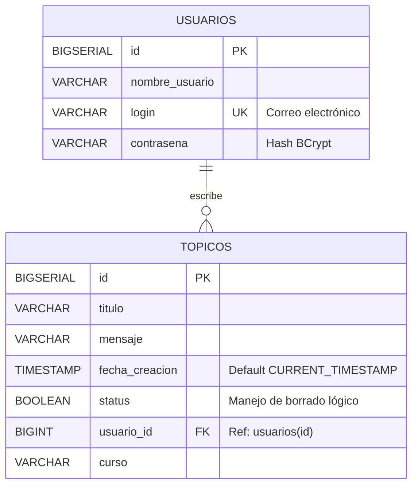

# 🚀 ForoHub - API REST 


**ForoHub** es una API REST robusta desarrollada en **Java con Spring Boot**. Este proyecto simula el back-end de un foro de discusión, permitiendo gestionar la creación, consulta, actualización y eliminación de tópicos. 

Destaca por su arquitectura limpia, manejo relacional de bases de datos y un estricto sistema de seguridad basado en tokens (JWT), implementando las mejores prácticas de desarrollo y Clean Code.

---

## ✨ Características Principales

- **Autenticación Stateless:** Login seguro y generación de tokens JWT.
- **Protección de Rutas:** Filtro personalizado que intercepta peticiones para validar la autorización del usuario.
- **CRUD Completo:** Gestión integral de tópicos asociados a usuarios específicos.
- **Integridad de Datos:** Base de datos relacional (1:N) con llaves foráneas y restricciones de unicidad.
- **Borrado Lógico:** Los registros eliminados no desaparecen de la base de datos, sino que cambian su estado para mantener el historial.
- **Gestión Global de Errores:** Manejo centralizado de excepciones (400, 403, 404) para devolver respuestas JSON estandarizadas y amigables.

---

## 🗄️ Modelo de Base de Datos (ERD)

La base de datos está diseñada con una relación **Uno a Muchos (1:N)**. Un usuario puede crear múltiples tópicos, pero un tópico pertenece a un único creador. Flyway se encarga de gestionar estas migraciones de forma automática.




## 🛣️ Endpoints de la API

La API cuenta con los siguientes endpoints principales. Todas las rutas (excepto el login) requieren enviar el token en el Header: `Authorization: Bearer <token>`

| Método | Ruta | Descripción | Auth |
| :--- | :--- | :--- | :---: |
| `POST` | `/login` | Autentica al usuario y devuelve el token JWT. | ❌ |
| `POST` | `/topicos` | Crea un nuevo tópico asociado a un `idUsuario`. | ✅ |
| `GET` | `/topicos` | Lista los tópicos activos (`status = true`) con paginación (`size=10`). | ✅ |
| `GET` | `/topicos/{id}` | Muestra el detalle de un tópico específico. | ✅ |
| `PUT` | `/topicos` | Actualiza el título y/o mensaje de un tópico. | ✅ |
| `DELETE` | `/topicos/{id}` | Realiza un **borrado lógico** (`status = false`). | ✅ |

<details>
<summary><b>👀 Ver ejemplo de Petición POST a /topicos</b></summary>
<br>

**Request Body (JSON):**
```json
{
  "titulo": "Duda con Spring Security",
  "mensaje": "¿Cómo configuro el SecurityFilterChain?",
  "idUsuario": 1,
  "curso": "Spring Boot 3"
}
```
</details>

## ⚙️ Instalación y Configuración Local

Sigue estos pasos para ejecutar el proyecto en tu entorno local:

### 1. Requisitos Previos
- **Java 17** o superior.
- **Maven** instalado.
- **PostgreSQL** instalado y ejecutándose.

### 2. Clonar el repositorio
```bash
git clone https://github.com/LuisFloresA/Challenge-Foro-Hub/
```

### 3. Configurar Variables de Entorno
El proyecto utiliza variables de entorno para proteger credenciales sensibles. Configura las siguientes variables en tu sistema operativo o en tu IDE (como IntelliJ IDEA o Eclipse):
```bash
DB_HOST (Ej: localhost:5432)
DB_NAME (Ej: forohub - Asegúrate de haber creado esta base de datos vacía en PostgreSQL)
DB_USER (Tu usuario de Postgres)
DB_PASSWORD (Tu contraseña de Postgres)
JWT_SECRET (Palabra secreta para firmar los tokens, ej: mi_clave_secreta_jwt_123)
```

### 4. Ejecutar la Aplicación
Al levantar la aplicación, Flyway detectará que la base de datos está vacía y ejecutará automáticamente los scripts de migración (V1 y V2) para crear las tablas y relaciones.

### 💡 Pruebas y Uso Inicial (Primer Login)
- Dado que la API está protegida con seguridad JWT Stateless, para probar los endpoints de los tópicos necesitarás tener al menos un usuario registrado en la base de datos para iniciar sesión y obtener tu token.
- Abre tu gestor de base de datos (como pgAdmin, DBeaver o la consola integrada de tu IDE).
- Ejecuta el siguiente script SQL para crear un usuario de prueba. (La contraseña 123456 ya se encuentra encriptada con BCrypt para que el sistema de login la reconozca):
```bash
INSERT INTO usuarios (nombre_usuario, login, contrasena)
VALUES ('Usuario de Prueba', 'admin@foro.com', '$2a$10$Y50UaMFOxteibQEYLrwuHeehHYfcoafCopUazP12.rqB41bsolF5.');
```
- Ve a tu cliente HTTP (Postman, Insomnia) y realiza una petición POST a http://localhost:8080/login con el siguiente Body JSON:
```json
{
  "login": "admin@foro.com",
  "contrasena": "123456"
}
```
- Copia el token JWT que te devuelve la respuesta, colócalo en la pestaña Authorization de tus siguientes peticiones (seleccionando el tipo Bearer Token) y ¡ya tienes acceso completo para crear, listar, editar y eliminar tópicos!


## Ejemplos:
- ### Solicitud token
  
- ### Servicio rechaza solicitud sin token:


- ### Listado de tópicos:


- ### Solicitud de un único tópico:


- ### Modificar tópico:


- ### Eliminar tópico (status):


- ### Agregar tópico:


